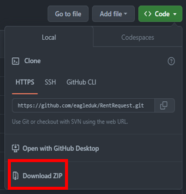

# Extension Install

## 1. 다운로드

1. https://github.com/eagleduk/RentRequest 접속
2. code → Download ZIP 클릭

3. 압축 해제

4. Chrome 실행
5. Chrome 맞춤설정 및 제어 → 도구 더보기 → 확장프로그램

6. 개발자 모드 on

7. 압축해제된 확장 프로그램 로드

8. 압축해제된 폴더 선택

9. 설치 확인

---

## 2. Option Value Setting

1. Extension 활성화

2. Chrome 주소창 옆 활성화 확인

3. 우 클릭후 옵션값 설정

4. 옵션값 입력

- 시간 : 06 ~ 20시 2시간 간격 선택
- 클럽명 입력
- 연락처 입력 : 010 번호 이후 본인 번호 입력
- 이용인원 입력
- 회장명 입력
- 회장 연락처 입력 : 010 번호 이후 회장 연락처 입력

5. 데이터 저장

---

## 3. 운동장 예약

1. Extension 선택

2. 로그인 페이지 이동

3. 성남시청 로그인 `(**회원 가입 필수**)`

4. 예약 날짜 및 시간 선택

- 날짜는 기본 **`다음달 오늘`** 로 선택 **( 예약 가능 기간 7일 후 ~ 다음달 오늘 )**
- 시간은 저장된 옵션값으로 선택

5. 예약 신청 페이지 이동

6. 옵션값 입력

7. 행사계획서 첨부 `( **첨부 파일은 추후 배포** )`

8. 참여자명단 첨부 `( **첨부 파일은 추후 배포** )`

9. 예약 저장

---

## 4. 예약 확인

